# ImageJ_tracker
Object tracker for the Forskolin Induced Swelling (FIS) assay


This macro takes `count masks` images obtained from ImageJ, tracks objects and reassigns the labels. The tracking algorithm is designed for the [Forskolin Induced Swelling (FIS) assay](https://github.com/hmbotelho/fis_image_analysis). In this assay objects are mostly imobile but coalescing and splitting are frequent.  


## Files  
* `simulate_labels.ijm` - simulates the data shown below  
* `object_tracker.ijm` - object tracking macros  


## Simulated data

### Segmented objects  
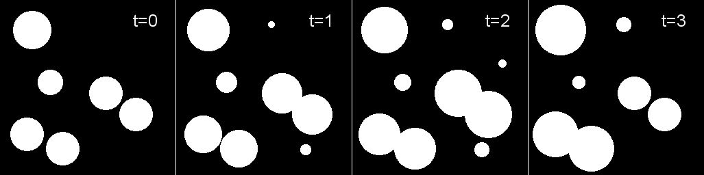  

### Connected component analysis  
In ImageJ: analyze particles + count masks  
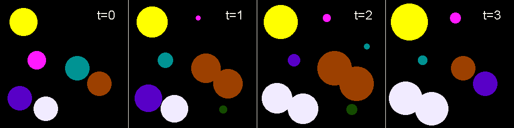  

### Desired output: tracked objects  
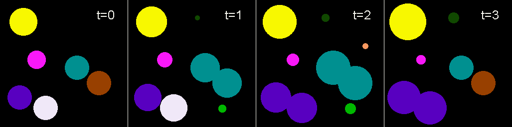  

The simulated data shows several behaviours that can be observed during the assay:  

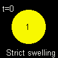 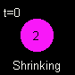 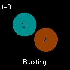 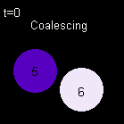 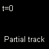 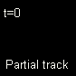 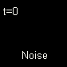
  

## Algorithm
1. Starting from the first frame, visit each frame and consider each object as a ROI.  
2. Check the most common label in the ROI at all previous frames (*i.e.* mode).  
3. If the label does not change, keep it.  
4. If there has never been a label in that ROI, assign a new label (previously unused label).  
5. If there are two equally common labels (bimodal), choose the lowest.  
6. If the ROI has been previously labeled with two or more distinct labels (*e.g.* coalescing+burst), exclude all labels already assigned in the current frame and select the lowest of the remaining ones.  


## Usage

The tracking procedure is implemented in the `trackOrganoidLabels()` function (`object_tracker.ijm`).  
`trackOrganoidLabels()` takes 3 parameters:  
* *files*, paths to the count masks images from a single time lapse.  
* *targetfolder*, where to save the relabeled images.  
* *suffix*, this suffix will be added to the relabeled images.  

```
sourcefolder = "C:/Users/Hugo/Desktop/test_data/simulated";
targetfolder = "C:/Users/Hugo/Desktop/test_data/simulated_out";
allfiles = newArray(sourcefolder + "/AnalyzeParticles--T0000.tif", sourcefolder + "/AnalyzeParticles--T0001.tif", sourcefolder + "/AnalyzeParticles--T0002.tif", sourcefolder + "/AnalyzeParticles--T0003.tif");

trackOrganoidLabels(allfiles, targetfolder, "--tracked");
```

## Outputs

1. Saves relabeled images  
2. A numeric representation of the tracking process, which shows up as an open image (below).  
  
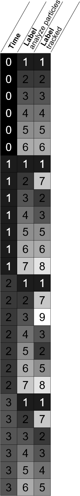
